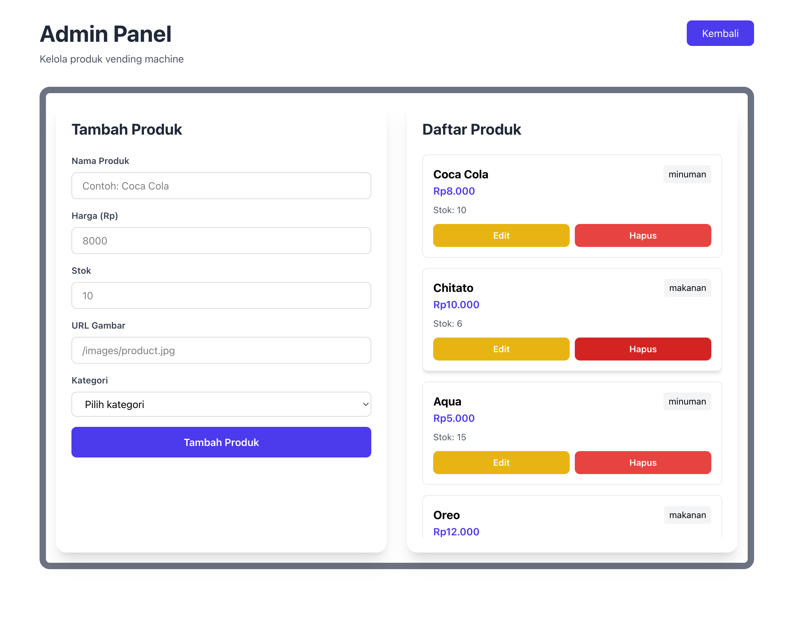
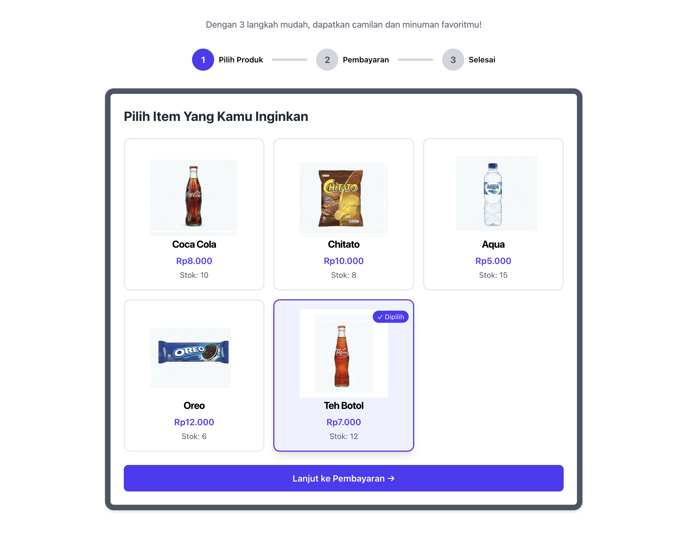
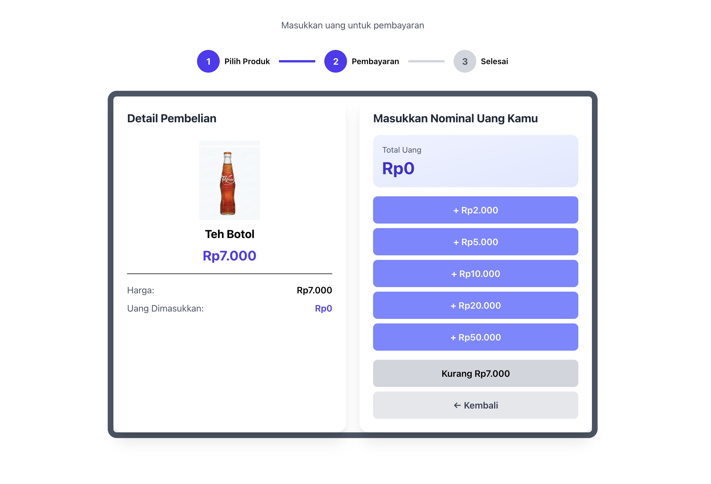
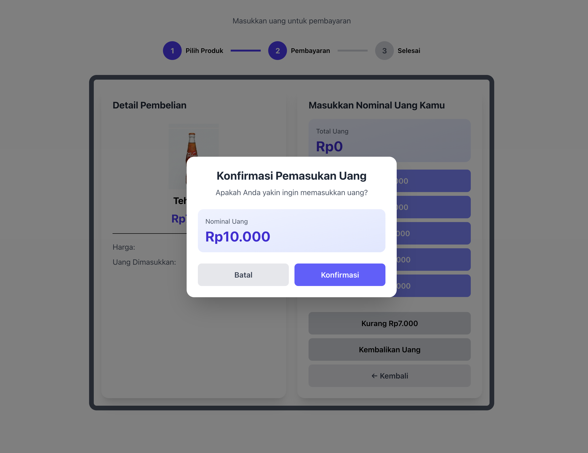
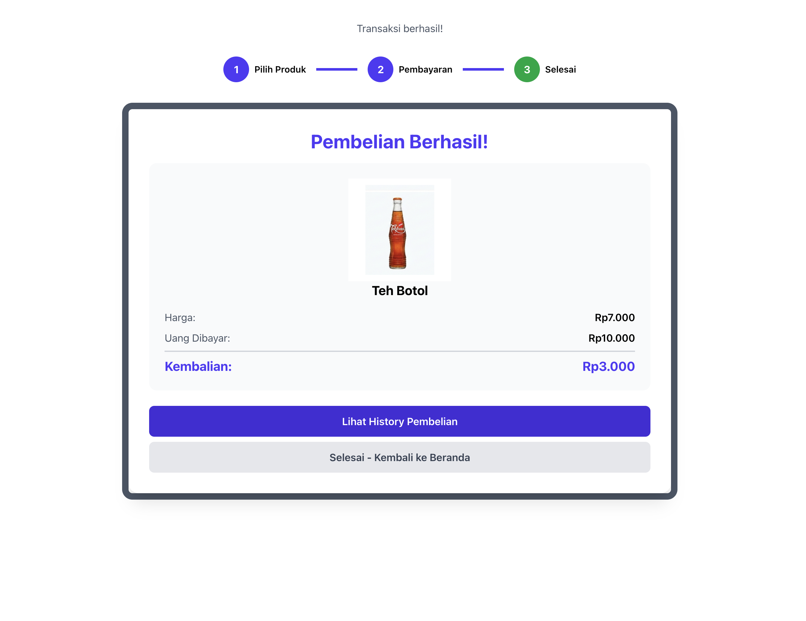

# Vending Machine App 

#### 1. Vending Machine Display
- ✅ Shows 5 food/drink items
- ✅ Each item displays: Image, Name, Price, Stock
- ✅ Visual representation with emojis
- ✅ Responsive product grid

#### 2. Money Input Simulation
- ✅ 5 denominations: Rp2.000, Rp5.000, Rp10.000, Rp20.000, Rp50.000
- ✅ Real-time total display
- ✅ Return money button

#### 3. Product Purchase
- ✅ Click "Beli" button to purchase
- ✅ Validates insufficient money
- ✅ Validates out of stock
- ✅ Reduces stock after purchase
- ✅ Displays change amount
- ✅ Success confirmation

#### 4. Admin Panel
- ✅ Route: `/admin`
- ✅ **CRUD Operations**:
  - ✅ Create (Add new product)
  - ✅ Read (List all products)
  - ✅ Update (Edit product)
  - ✅ Delete (Remove product)
- ✅ Form validation with react-hook-form + yup

#### 5. Transaction History
- ✅ Route: `/history`
- ✅ All purchases saved to json-server
- ✅ Display transaction list
- ✅ Shows: Product, Price, Money, Change, Time

# Screenshots








# Installation Guide

## Prerequisites

- **Node.js**: v18.0.0 or higher 
- **npm**: v9.0.0 or higher 

## Step-by-Step Installation

### Step 1: Navigate to Project Directory

```bash
cd /Users/agilsaputra/Desktop/vending-machine-app
```

### Step 2: Install All Dependencies

```bash
npm install
```

## Running the Application

### Using Two Terminals 

#### Terminal 1: Start json-server
```bash
npm run json-server
```

#### Terminal 2: Start Next.js Development Server
```bash
npm run dev
```


## Accessing the Application

| URL | Description |
|-----|-------------|
| http://localhost:3000 | Main Vending Machine |
| http://localhost:3000/admin | Admin Panel (CRUD) |
| http://localhost:3000/history | Transaction History |
| http://localhost:3001/products | API: Products (json-server) |
| http://localhost:3001/transactions | API: Transactions (json-server) |

